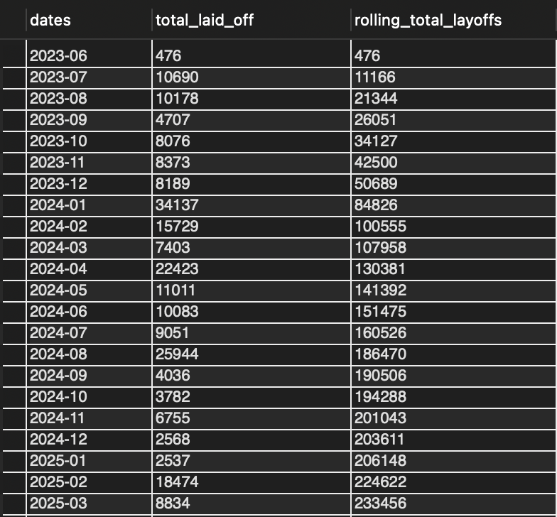

# 📊 Tech Layoffs Exploratory Data Analysis in SQL

This repository contains my SQL project for exploratory data analysis (EDA) on a tech layoffs dataset. Using the cleaned layoffs table from my previous SQL data-cleaning project, I explored patterns in layoffs across companies, industries, countries, years, and company stages.

---

## 📌 Introduction

This project focuses on exploring trends and patterns in a tech layoffs dataset using SQL. After cleaning the raw data in a separate preprocessing workflow, I used SQL queries to investigate the scale, timing, and distribution of layoffs across the tech sector.

The analysis shows how SQL can be used not only for cleaning data, but also for extracting meaningful business insights from structured datasets.

---

## 💡 Motivation

Layoffs data can reveal important patterns about economic pressure, industry instability, startup funding challenges, and company-level risk over time.

The goal of this project is to use SQL-based exploratory analysis to answer questions such as:

- Which companies had the largest layoffs?
- Which industries and countries were most affected?
- How did layoffs change over time?
- Which companies had the highest layoffs in each year?
- How did cumulative layoffs grow month by month?

This project demonstrates how SQL can turn a cleaned dataset into clear analytical findings.

---

## 📂 Dataset Description

This project uses the cleaned layoffs dataset from my previous SQL data-cleaning project.

The analysis is performed on the table:

- `world_layoffs.layoffs_staging2`

Key variables used in the EDA include:

- `company`
- `location`
- `country`
- `industry`
- `total_laid_off`
- `percentage_laid_off`
- `date`
- `stage`
- `funds_raised_millions`

Because the data was already cleaned beforehand, this project focuses on exploration and trend analysis rather than preprocessing.

---

## 🔍 Exploratory Analysis Goals

The SQL queries in this project explore several types of analytical questions:

### 1. Scale of layoffs
- maximum number of layoffs in a single event
- maximum and minimum layoff percentages
- companies with 100% layoffs

### 2. Company-level impact
- companies with the biggest single layoff events
- companies with the highest total layoffs overall
- top companies by layoffs in each year

### 3. Geographic and industry trends
- layoffs by location
- layoffs by country
- layoffs by industry
- layoffs by company stage

### 4. Time-based trends
- layoffs by year
- layoffs by month
- rolling cumulative total of layoffs over time

---

## 🧪 SQL Analysis Techniques Used

This project uses a range of SQL analysis techniques, including:

- `GROUP BY`
- `SUM()`
- `MAX()`
- `MIN()`
- `YEAR()`
- `ORDER BY`
- `LIMIT`
- Common Table Expressions (`WITH`)
- window functions
- `DENSE_RANK()`
- `SUM() OVER (...)`
- monthly grouping with `SUBSTRING()`

These techniques support both descriptive summaries and more advanced ranking and time-based analysis.

---

## 📊 Key Visualisations

### 1. Top 3 Companies with the Highest Layoffs by Year

This output shows the top three companies with the highest total layoffs in each year. The query uses a Common Table Expression together with `DENSE_RANK()` to rank companies within each year based on total layoffs. This makes it easier to compare major layoff events across different years rather than only across the full dataset.

### 2. Rolling Total of Layoffs Per Month

This output displays monthly layoffs and a rolling cumulative total over time. The analysis first aggregates layoffs by month and then applies a window function using `SUM() OVER (ORDER BY dates)` to calculate the running total. This helps show how layoffs built up across the full period covered by the dataset.

---

## 📈 Main Analysis Sections

### 1. High-level descriptive queries

The first part of the project explores simple but useful questions such as:

- the maximum layoffs recorded in a single row
- the range of layoff percentages
- which companies laid off 100% of their staff

This helps identify extreme events and companies that effectively shut down.

### 2. Aggregated layoff trends

The next section uses `GROUP BY` and `SUM()` to identify:

- companies with the highest total layoffs
- most affected locations
- most affected countries
- most affected industries
- company stages associated with larger layoff totals

These queries provide a broad summary of where layoffs were concentrated.

### 3. Top companies by year

Using CTEs and `DENSE_RANK()`, I ranked companies by total layoffs within each year and extracted the top three for each year.

This makes it possible to compare the biggest layoff contributors across different years rather than only across the full dataset.

### 4. Monthly and rolling layoffs trend

I also grouped layoffs by month and then applied a window function to calculate a rolling cumulative total over time.

This helps show how layoffs built up month by month across the full period covered by the dataset.

---

## 📌 Key Insights

Some of the main insights supported by the SQL analysis include:

- some companies recorded very large single layoff events
- several firms had `percentage_laid_off = 1`, indicating complete workforce cuts
- layoffs varied significantly across industries, countries, and company stages
- the companies with the highest layoffs changed from year to year
- rolling totals helped reveal the broader cumulative trend in layoffs over time

---

## 📁 Files

- `EDA_SQL_Project.sql` — SQL script containing all exploratory analysis queries
- `Screenshot 2026-04-10 at 2.49.34 pm.png` — top companies by layoffs for each year
- `Screenshot 2026-04-10 at 2.52.09 pm.png` — rolling cumulative layoffs by month
- cleaned layoffs dataset/table from the previous project:
  - `world_layoffs.layoffs_staging2`

---

## ▶️ How to Run the Project

1. Open your SQL environment, such as **MySQL Workbench**
2. Make sure the cleaned table `world_layoffs.layoffs_staging2` already exists
3. Open and run the queries in `EDA_SQL_Project.sql`
4. Review the outputs to explore:
   - top layoff companies
   - yearly and monthly trends
   - geographic and industry patterns
   - rolling cumulative layoff totals

---

## 🛠️ Skills Demonstrated

This project highlights practical SQL skills in:

- exploratory data analysis
- aggregations and grouping
- ranking with window functions
- time-based trend analysis
- rolling totals
- using CTEs for multi-step analysis
- business insight generation from structured data

---

## 🎯 Project Goal

The goal of this project is to demonstrate how SQL can be used for exploratory data analysis after data cleaning is complete.

This project shows how structured SQL queries can be used to uncover real patterns in business and economic data, helping transform raw tables into understandable trends and insights.
